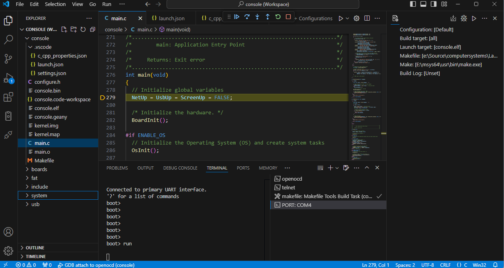
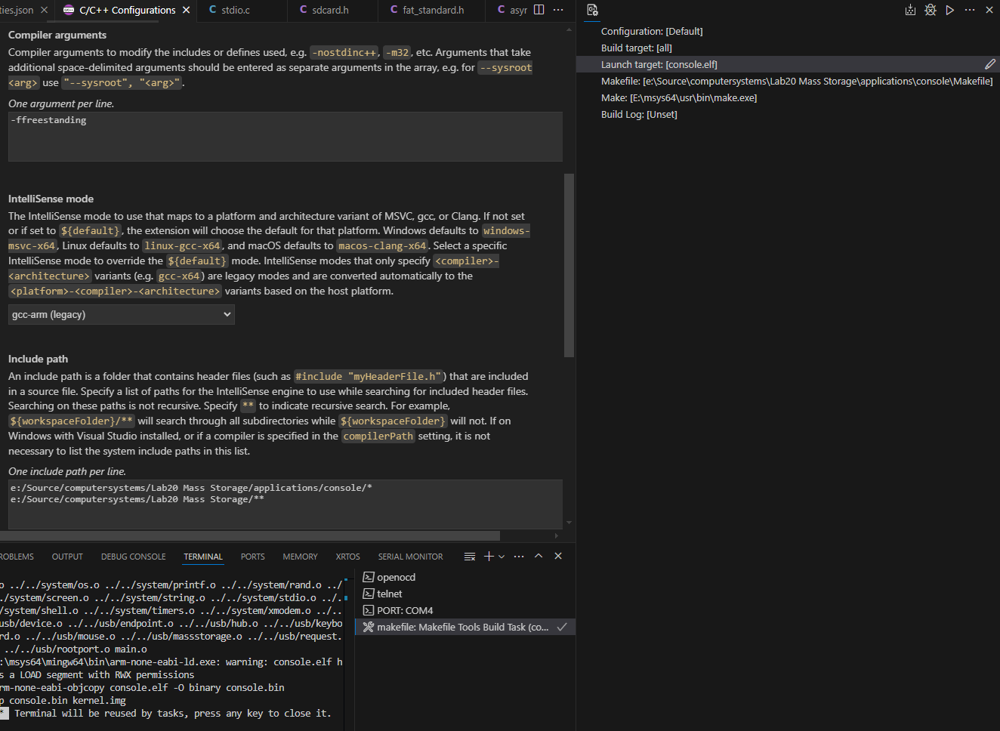

# Visual Studio Code IDE for bare metal Raspberry Pi



Long a favorite for web developers, Microsoft Visual Studio Code now has extensions and features to robustly support embedded software development. This article describes how to set up a workspace for rapid development of a bare metal embedded device utilizing JTAG and UART connections between the cross-compiling development PC and a bare metal ARM embedded device, in this example, a Raspberry Pi.

This article assumes that a cross-compiler and Makefile tools are already installed on the development PC. See the Computer Systems Book [Appendix A](https://sean-lawless.github.io/computersystems/AppendixA.html) for more details. It is also assumed that the latest OpenOCD is installed on the PC and a UART/JTAG adapter is connected correctly between the PC and embedded device (Raspberry Pi, ie. RPi). It is also assumed that a command line GDB can connect and debug the RPi through OpenOCD and JTAG. The goal of this article is to transfer all the development flows out of various command line prompts and into the Visual Studio Code IDE for a deeper and more integrated developer experience. While the examples provided are specific to the Appendix A environment referenced above, many of the concepts are similar and can be applied to other remote development environments over a JTAG/SWD interface.

So, let’s get started. After installing Visual Studio Code, we open it and create a workspace. From the File menu select Open Folder… and select the folder for the application, for example the Lab20 Mass Storage/applications/console folder which is a part of the Open-Source GitHub project [Computer Systems](https://sean-lawless.github.io/computersystems). Next it is important to add the library and OS scheduler code folders to the application. Select Add Folder to Workspace… and select every folder in the Lab20… directory EXCEPT the applications folder.

With all the code now in the workspace we also need to help set up the C/C++ Configuration to support our tool chain and directory structure. Press Ctrl-Shift-P and select C/C++: Edit Configurations (UI) then select the console folder. The IntelliSense Configurations screen will appear. Select Add Configuration, name it something like Arm-RPi and set the Compiler path to your cross compiler, such as C:\msys64\mingw64\bin\arm-none-eabi-gcc.exe and for Compiler arguments add -freestanding and set IntelliSense mode to gcc-arm (legacy) and, most importantly add these two lines to the Include path.

```
c:/Source/computersystems/Lab20 Mass Storage/applications/console/*
c:/Source/computersystems/Lab20 Mass Storage/**
```



Be sure to modify them for your code installation directory. The resulting c_cpp_properties.json configuration will look something like this.

```
{
    "configurations": [
        {
            "name": "ARM-RPi",
            "includePath": [
                "c:/Source/computersystems/Lab20 Mass Storage/applications/console/*",
                "c:/Source/computersystems/Lab20 Mass Storage/**"
            ],
            "defines": [
                "_DEBUG",
                "UNICODE",
                "_UNICODE"
            ],
            "compilerPath": "C:\\msys64\\mingw64\\bin\\arm-none-eabi-gcc.exe",
            "cStandard": "c17",
            "cppStandard": "gnu++17",
            "intelliSenseMode": "gcc-arm",
            "mergeConfigurations": false,
            "configurationProvider": "ms-vscode.makefile-tools",
            "browse": {
                "path": [
                    "c:/Source/computersystems/Lab20 Mass Storage/applications/console/**",
                    "${workspaceFolder}"
                ],
                "limitSymbolsToIncludedHeaders": true
            },
            "compilerArgs": [
                "-ffreestanding"
            ]
        }
    ],
    "version": 4
}
```

With all the code now in the workspace and IntelliSense configured, Visual Studio Code will be able to autocomplete and jump to Declarations, Definitions, etc. when left clicking any function, macro or type definition. This is a great step forward vs. a simple text editor, but let’s go further. Current command line development flows require a terminal to be open with applications/console as the current directory to build the project with the make command. To move the build process to Visual Studio Code requires the Makefile Tools by Microsoft extension be installed. Select Extensions on the left pane and search for Makefile Tools and install it now.

Once the Makefile Tools extension is installed, move the new extension to the right pane of the Visual Studio Code so it is always accessible. Select Make and press the pencil icon to edit and add the path to your installed make command (make if in your path, or c:/msys64/usr/bin/make.exe or similar if not). Set the Makefile setting to point to the application makefile (applications/console/Makefile) and the Launch target to console.elf and the Build target to all’ Then press the Makefile: build the current target button and the make command will be initiated in a new Visual Studio Code Terminal window. Any compile errors can be Ctrl-Clicked to open the file in the editor at the line of the error. Another productivity improvement from manually navigating to the line of the error using an editor outside the compile environment.


With the code editor and build process now integrated, only the debugging flow still requires command line initiation in a terminal window. The next step is to run OpenOCD in a new Terminal window attached to Visual Studio Code. In the bottom middle pane select TERMINAL and press the plus icon for New Terminal and select the console directory to start in. Now, in this terminal run the OpenOCD command for your connection and hardware configuration. Here is an example for Windows development PC using the SiPeed USB to JTAG/UART adapter communicating with a Raspberry Pi version 1. See Appendix A and the Computer Systems book for more information.

```
console> openocd -f ../../boards/rpi/openocd_sipeed_jtag.cfg -f ../../boards/rpi/rpi1_jtag.cfg
Open On-Chip Debugger 0.12.0
Licensed under GNU GPL v2
For bug reports, read
        http://openocd.org/doc/doxygen/bugs.html
DEPRECATED! use 'ftdi device_desc' not 'ftdi_device_desc'
DEPRECATED! use 'ftdi vid_pid' not 'ftdi_vid_pid'
DEPRECATED! use 'ftdi layout_init' not 'ftdi_layout_init'
DEPRECATED! use 'ftdi layout_signal' not 'ftdi_layout_signal'
DEPRECATED! use 'ftdi layout_signal' not 'ftdi_layout_signal'
Info : Listening on port 6666 for tcl connections
Info : Listening on port 4444 for telnet connections
Info : clock speed 1000 kHz
Info : JTAG tap: raspi.arm tap/device found: 0x07b7617f (mfg: 0x0bf (Broadcom), part: 0x7b76, ver: 0x0)
Info : found ARM1176
Info : raspi.arm: hardware has 6 breakpoints, 2 watchpoints
Info : starting gdb server for raspi.arm on 3333
Info : Listening on port 3333 for gdb connections
Info : accepting 'telnet' connection on tcp/4444
Info : accepting 'gdb' connection on tcp/3333
```

Now save your workspace, exit Visual Studio Code and reopen it and you will notice this Terminal is open, but no command is running. Click in this Terminal and press the up-arrow key until you see the previous command for openocd above, press enter, and it will connect. Be sure the RPi is connected, powered on and running the bootloader application by default (or another application that configures the GPIO pins for JTAG, like dwelch67 JTAG app), otherwise OpenOCD will display connection errors.

The expected final step is to install the serial terminal by awsxxf Extension and use it instead of ExtraPutty or TeraTerm to connect to the debug UART of the RPi for access to the bare metal console shell interface executing on the RPi. Once the extension is installed, click the Serial Port Resouce Manager icon on the left pane, select the COM port and press the arrow key, then select the default configuration (115200n1) and the console will open displaying the output from the application executing on the embedded device (RPi in this case). The new serial port console works great with one exception, it is missing the Xmodem protocol for transferring files. So, we now have all the pieces except the ability to load a newly build binary image onto the hardware for execution. We will revisit this soon.

The final step to debugger support is to configure the Run and Debug pane on the left side of Visual Studio Code. Select this pane and press the configuration wheel in the top left to open the launch.json file to configure your debugger settings. Select the Add Configuration button at the bottom of the page and select ‘{} C/C++: (gdb) launch’. This will create a boiler plate configuration that we have to change to our cross compiler and debugger. Edit the launch.json file to look like that below, with the paths changed to match your application if different.

```
{
  // Use IntelliSense to learn about possible attributes.
  // Hover to view descriptions of existing attributes.
  // For more information, visit: https://go.microsoft.com/fwlink/?linkid=830387
  "version": "0.2.0",
  "configurations": [
    
  {
      "name": "GDB attach to openocd",
      "type": "cppdbg",
      "request": "launch",
      "program": "${workspaceFolder}\\console.elf",
      "args": [],
      "stopAtEntry": true,
      "cwd": "${workspaceFolder}",
      "environment": [],
      "externalConsole": false,
      "MIMode": "gdb",
      "setupCommands": [
          {
              "description": "Enable pretty-printing for gdb",
              "text": "-enable-pretty-printing",
              "ignoreFailures": true
          }
      ],
      "miDebuggerPath": "gdb-multiarch.exe",
      "miDebuggerServerAddress": "127.0.0.1:3333"
  }
  ]
}
```

Note that the miDebuggeerPath and ServerAddress are set to use the ARM debugger (multiarch) and connect to the OpenOCD server we started in the Terminal previously. Save the changes and now in the top Debugger pane, next to the green Run arrow, drop down the selection and choose the new target GDB attach to openocd previously configured. Then press green Start Debugging button. A new DEBUG CONSOLE will appear in the bottom pane next to the TERMINAL windows that is executing GDB. It will connect to OpenOCD automatically and run your application until main() is hit because the stopAtEntry setting is true. Except it does not. This is because our application is not running on the target board yet, the ‘bootloader’ application is still executing and the debugger does not know about this application.

With no serial terminal extension available that supports Xmodem, to upload the new executable requires we pivot to leverage the JTAG interface to load a newly compiled application. Fortunately, GDB supports the ‘load’ command so within the opened the DEBUG CONSOLE, ensure the debugger is paused (pause button) and issue the command -exec load console.elf.

```
-exec load console.elf
Loading section .text, size 0x190fc lma 0x8000
1063+download,{section=".text",section-size="102652",total-size="305084"}
1063+download,{section=".text",section-sent="16240",section-size="102652",total-sent="16240",total-size="305084"}
Load failed
```

Unfortunately, there are some issues with the JTAG and RPi boards, so this load fails for the new executable file (.elf). To work around the issue, we go back to the TERMINAL and open a new one in the console application directory (or any for that matter) and connect to OpenOCD directly with telnet. Once connect to OpenOCD with telnet we can issue the fast_load_image console.elf and fast_load commands to copy the executable image to the RPi’s memory for debugging. Substitute your application file instead of console.elf if different.

```
console> telnet 127.0.0.1 4444
Trying 127.0.0.1...
Connected to 127.0.0.1.
Escape character is '^]'.
Open On-Chip Debugger
accepting 'gdb' connection on tcp/3333
target halted in ARM state due to debug-request, current mode: Supervisor
cpsr: 0x200001d3 pc: 0x01001d7c
Prefer GDB command "target extended-remote :3333" instead of "target remote :3333"
> fast_load_image console.elf
143185 bytes written at address 0x00008000
Loaded 143185 bytes in 0.000320s (436965.969 KiB/s)
WARNING: image has not been loaded to target!You can issue a 'fast_load' to finish loading.
> fast_load
27306 words out of 35796 not transferred
Write to 0x00008000, length 0x00022f51
```

Fortunately these commands ignore the transfer warnings and write the binary image to the memory (at address 0x8000 as specified in the .elf file and our Makefile). Now we press the Continue button in the debugger pane but again nothing happens. Why? Because we are still executing the bootloader application. Open the serial console (PORT: COM? window in bottom TERMINAL pane) and the shell should be responsive. If not, be sure the debugger is not paused. Enter the run command in the serial terminal to begin execution of the application at address 0x8000.

```
boot> run

Computer Systems
  Using priority loop scheduler
Copyright 2015-2019 Sean Lawless.
  All rights reserved.

Connected to primary UART interface.
'?' for a list of commands
Console application
01000000 : stack pointer
shell> 
```

If all went correctly, after the run command the debugger will stop automatically at the top of your application main() function. You can now debug your application directly from within Visual Studio Code. The proper sequence of events to repeatedly build and debug are as follows. First recycle the power to the RPi to re-enter the bootloader or exit the current application (console) with the exit command to reenter the bootloader. Then stop any debug session with red square button, re-build your application and from the debugger pane launch the debugger again. The debugger should start in the running state so press the pause button. With the board halted (debugger paused), switch to the telnet CONSOLE and issue the fast_load_image and fast_load commands — if you see errors ensure the debugger is paused. Then continue the application with the debugger and from the PORT: COM terminal issue the run command. The debugger should then stop at the application entry point main().

For this all to work be sure your Makefile must have -ggdb flag set when compiling, and -O0 to disable build optimizations. Otherwise you may see ?? in the DEBUG CONSOLE when the debugger is stopped as no source is known to the debugger. Now the entire development workflow is contained within Visual Studio Code as an Integrated Development Environment (IDE). I encourage you to play around and get familiar with using this new Visual Studio Code bare metal IDE.

I hope this tutorial has been helpful to you on your embedded systems development journey. Clap for this article and follow me for more great articles to come. And please leave comments on how you tweaked and/or improved upon this solution!

Carpe Animo.
