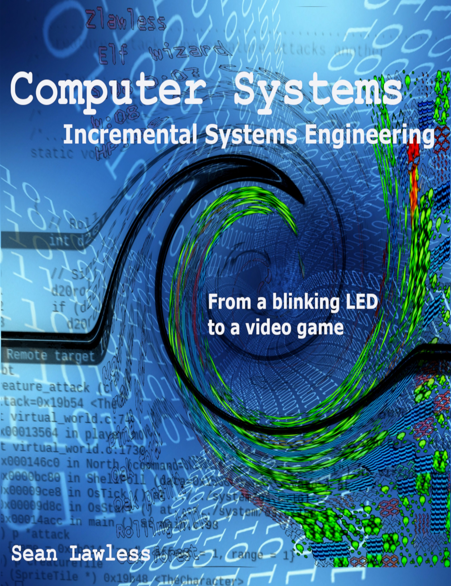

# Computer Systems

## Introduction

Welcome to the repository for the book Computer Systems Incremental Systems Engineering and associated Laboratory for Raspberry Pi. This source code repository is organized by the chapters of the book, one (1) through twelve (12). Each chapter is an accumulation of the source code created in the chapters before it.

If you found this repository before the books, below are the references into Leanpub for the books. If purchasing, the bundle (last link below) is highly recommended as only the Laboratory book explains the Raspberry Pi hardware details.

[Computer Systems](https://leanpub.com/computersystems)

[Computer Systems Lab for Raspberry Pi](https://leanpub.com/computersystems_lab_rpi)

[Computer Systems Bundle](https://leanpub.com/b/computersystemscomplete)

The first half of each book is available free from the top links above.
Click the Read Free Sample button and choose your reader format. Below are
some screenshots of using the debugger and playing the game in the
last chapter.

 

Print copies of the books are also available on Amazon.

[Computer Systems Series](https://www.amazon.com/gp/bookseries/B08HRB1VLB)

## Appendix A

Using the low cost SiPeed USB to UART/JTAG adapter and a Windows PC as
the development PC. This is an alternative to using a Raspbian development
PC.

[Appendix A: Windows Development PC](AppendixA.md)
